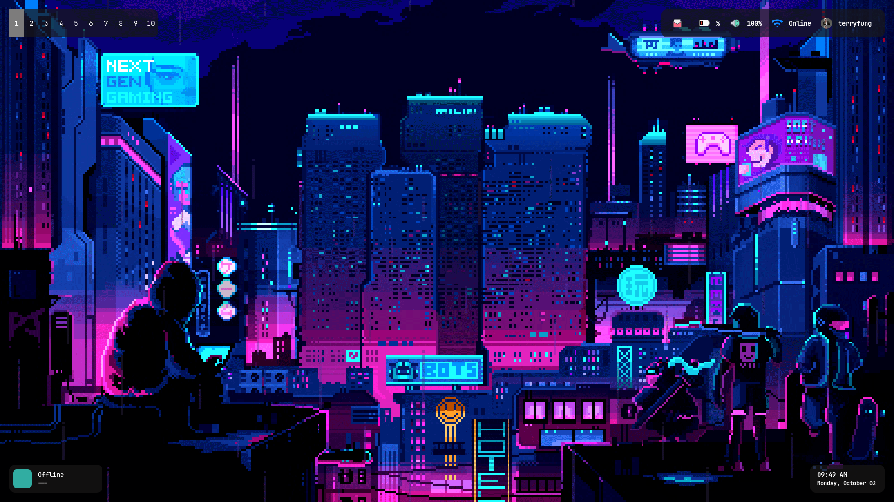
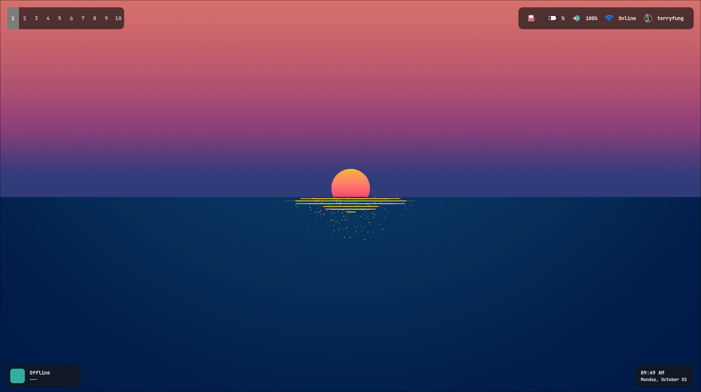

## Screen
<p align="center">
  
</p>

<p align="center">
  
</p>

## Requirements
- Window manager: [Hyprland](https://hyprland.org/)
- Bar/Wedget: [eww](https://github.com/elkowar/eww)
- Wallpaper engine: [swww](https://github.com/Horus645/swww)

## Other Requirements
ps. below app can replaced
- Terminal: Alacritty
- App launcher: wofi

## Wedget Style
[To link](https://github.com/TerryFunggg/my_eww_widgets)

## Rofi 
[Original Config](https://github.com/adi1090x/rofi/tree/master)

move rofi theme config
(modify file path in style1)
```sh
cp -R rofi ~/.config/
```
